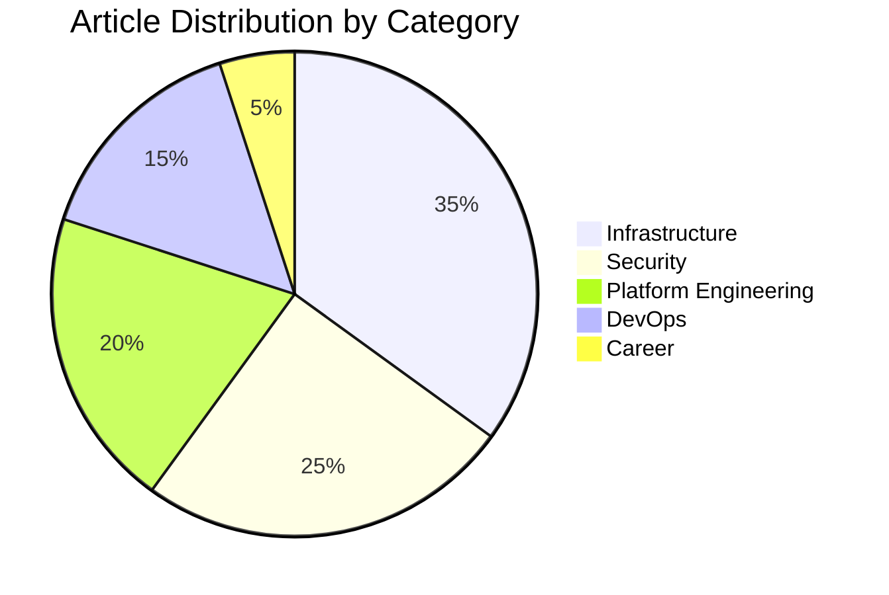

# 📝 Technical Blog - Platform Engineering Insights

> Technical articles, tutorials, and insights from a platform engineer's journey

## 📚 Article Categories

### 🏗️ Infrastructure as Code
- Terraform best practices and patterns
- CloudFormation vs Terraform comparison
- Multi-cloud infrastructure strategies

### 🔧 Platform Engineering
- Building internal developer platforms
- GitOps implementation guides
- Service mesh architectures

### 🔒 Security & Compliance
- Zero Trust architecture implementation
- Cloud security best practices
- Compliance automation strategies

### 📊 Observability
- Distributed tracing setup
- Metrics that matter
- Log aggregation patterns

### 🚀 DevOps Culture
- CI/CD pipeline optimization
- Team collaboration tools
- Incident response procedures

## 📖 Featured Articles

### 1. **Building a Production-Ready Kubernetes Platform**
*Published: March 2024*

A comprehensive guide to building a Kubernetes platform that developers love, covering:
- Cluster architecture decisions
- Security hardening
- Developer experience optimization
- Cost management strategies

[Read More →](articles/k8s-platform-guide.md)

### 2. **From Network Engineer to Platform Engineer**
*Published: February 2024*

My transition journey and lessons learned:
- Skill gap analysis
- Learning path recommendations
- Career transition strategies
- Real-world project examples

[Read More →](articles/career-transition.md)

### 3. **Automating Cisco ISE with Python**
*Published: January 2024*

Deep dive into ISE automation:
- REST API fundamentals
- pxGrid integration
- Bulk operations
- Error handling patterns

[Read More →](articles/ise-automation.md)

## 📝 Writing Schedule

| Day | Topic | Status |
|-----|-------|--------|
| Monday | Infrastructure | 📝 Drafting |
| Wednesday | Security | ✅ Published |
| Friday | Tutorial | 🔄 Review |

## 🎯 2024 Writing Goals

- [ ] 52 articles (1 per week)
- [ ] 12 deep-dive tutorials
- [ ] 6 video companions
- [ ] 4 conference talk adaptations
- [ ] 1 eBook compilation

## 💡 Article Ideas Backlog

- Implementing SRE practices in small teams
- Cost optimization strategies for AWS
- Building a home lab for platform engineering
- Debugging distributed systems
- Infrastructure testing strategies

## 🤝 Guest Posts & Collaborations

Open to guest posts and collaborations on:
- Platform engineering practices
- Infrastructure automation
- Cloud architecture
- DevOps transformations

## 📊 Blog Statistics

## 🔗 Where to Find My Writing

- **Personal Blog**: [blog.example.com](https://blog.example.com)
- **Dev.to**: [@evanusmodestus](https://dev.to/evanusmodestus)
- **Medium**: [@evanusmodestus](https://medium.com/@evanusmodestus)
- **HashNode**: [evanusmodestus.hashnode.dev](https://evanusmodestus.hashnode.dev)

## 📮 Newsletter

Subscribe to my weekly newsletter for:
- New article notifications
- Exclusive content
- Tool recommendations
- Industry insights

[Subscribe →](https://newsletter.example.com)

## 💬 Engagement

I love hearing from readers! Feel free to:
- Open issues for article corrections
- Suggest new topics
- Share your implementations
- Ask questions

## 📄 License

All articles are licensed under [CC BY 4.0](https://creativecommons.org/licenses/by/4.0/) - feel free to share and adapt with attribution.

---

### ✍️ Technical Writing

**Learn** • **Build** • **Share** • **Grow**

*Documenting the journey, one article at a time*

Last verified: 2025-09-15
